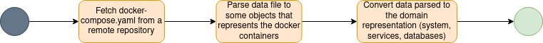

# Sorting Hat's Static Data Collector

The Sorting Hat is a tool under development which aims to characterize the architecture of service-based systems. The platform displays the system data, its services and databases, as well as the relationship between its components.
The MVP of the tool is available at [this link](https://the-sortinghat-front.herokuapp.com/).

The Static Data Collector is a backend application which aims to collect the data available on Sorting Hat.
The data is collected by analyzing configuration files from the system's remote code repository that represent the system components. This configuration files can be docker-compose files, for example.

This repository is a prototype for the semi-automated data collection of the Sorting Hat's static collector.
It analyzes a given docker-compose configuration file from a given remote repository url.

## Collector's workflow

The core workflow of the statical data collection is represented in the figure below.

