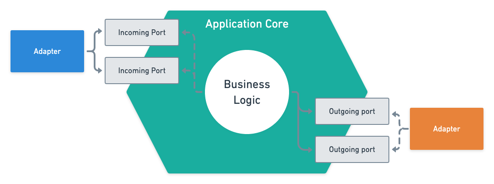

# Sorting Hat's Static Data Collector

The Sorting Hat is a tool under development which aims to characterize the architecture of service-based systems. The platform displays the system data, its services and databases, as well as the relationship between its components.
The MVP of the tool is available at [this link](https://the-sortinghat-front.herokuapp.com/).

The Static Data Collector is a backend application which aims to collect the data available on Sorting Hat.
The data is collected by analyzing configuration files from the system's remote code repository that represent the system components. This configuration files can be docker-compose files, for example.

This repository is a prototype for the semi-automated data collection of the Sorting Hat's static collector.
It analyzes a given docker-compose configuration file from a given remote repository url.

## How to run and test

- To run the application, execute the following command:

```shell
docker-compose up
```

<b>Note:</b> before executing the command above, create a `.env` file following with the variables inside the `.env.sample` file.

- To run the automated tests, execute the following command:
```shell
docker-compose run --rm app ./gradlew test
```

## Technologies

- Spring Boot framework.
- Kotlin programming language.
- MongoDB NoSQL database.
- Apache Kafka message broker.

## Collector's code architecture

This prototype was built following the hexagonal architecture concepts. This means that it separates the high-level elements (domain and business logic) from the low-level elements (frameworks, databases, infrastructure).
The communication between the lower and higher levels is done using ports and adapters. The figure below shows what is a hexagonal architecture.



## Collector's endpoints

This prototype is a RESTful web application which exposes the following endpoints:
```text
POST /systems      => to collect the data and create a system representation.
GET /systems/:id   => to get the analyzed system data.
```

For the `POST /systems` endpoint, the json below is an example of request's body.

```json
{
  "repoUrl": "https://github.com/codelab-alexia/buscar-hackathon",
  "filename": "docker-compose.yaml"
}
```

<b>Note:</b> the `repoUrl` param needs to be the root for the files. If the target file is inside some folders, explicit the path to the file in the `filename` param. Example: `"filename": ".docker/docker-compose.yaml"`.

## Collector's workflow

The core workflow of the statical data collection is represented in the figure below.


## Core Domain

The class diagram below represents the core domain regarding the collection process, according to the workflow shown in the previous subsection.


<b>Note:</b> this class diagram does not contain all classes of the system. It only shows the heart of the collection process, i.e, the domain entities and services, as well as the abstract interfaces.

Since this prototype aims to be extensible [1], we implement the core domain as much abstract as possible, to not depend on a specific technology or tool we want to collect the data.
For example, if we want to implement the collection for the docker-compose, we need to create a docker-compose representation which inherits from the `SpecificTechnology` class. We also need to create classes for each collection step, each one implementing the interfaces `DataFetcher`, `DataParser`, or `ConvertToDomain`.

[1] Extensible means that we would want to expand the collection process to cover other technologies besides docker-compose, such as Kubernetes.

How the `ExtractData` service works:
- Fetch the file data from a given url. This will give us a string that represents the file data.
- Parse that string to the specific technology we want to collect from. As an example, if we want to collect from docker-compose, the specific technology would be an entity that represents the docker-compose file, i.e., the containers and networks.
- From the specific technology, we would convert it to the domain representation: a service-based system. As an example, after representing the docker-compose, we will identify which containers represent services, which ones represent databases, which services use which databases, and so on.
- Having the system representation, we would want to save it by using a repository.

## Next steps

The prototype will be semi-automated, which means that the user will participate in the collection process.
The collection process discussed in the previous subsections is actually a pre-collection. This means that the user can modify the assumptions made in order to correct and conclude the collection.
We will implement that user interaction by working closely with the Sorting Hat's frontend.

Since this prototype will initially work only with docker-compose, we need to improve the heuristic used to identify which containers represent databases or services, as well as identify with more precision the databases usages by services.

## Authors

The code is being developed by [Erick Rodrigues de Santana](https://github.com/erickrodrigs) from the Institute of Mathematics and Statistics of the University of São Paulo.
This work is part of an undergraduate research guided by the professor Dr. Alfredo Goldman.

## How to contribute

Open a PR and mark @erickrodrigs as a reviewer. Please, summarize the changes made.

